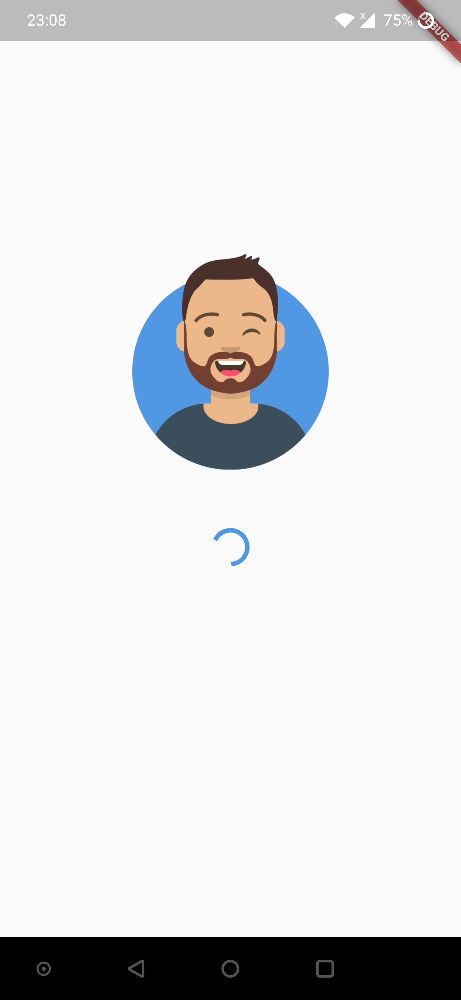
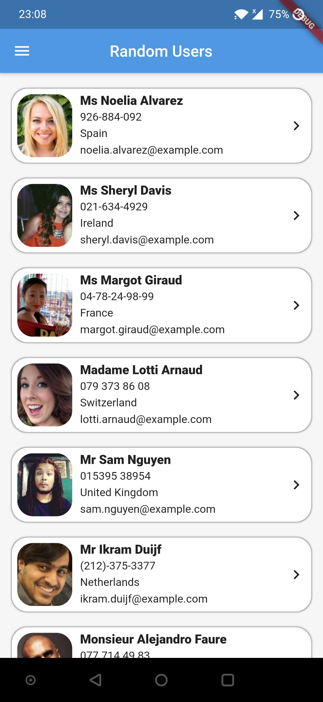
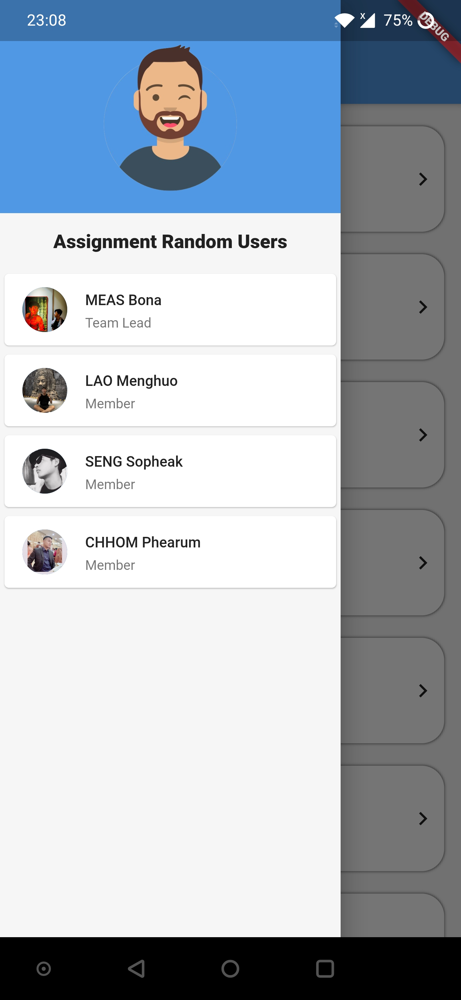
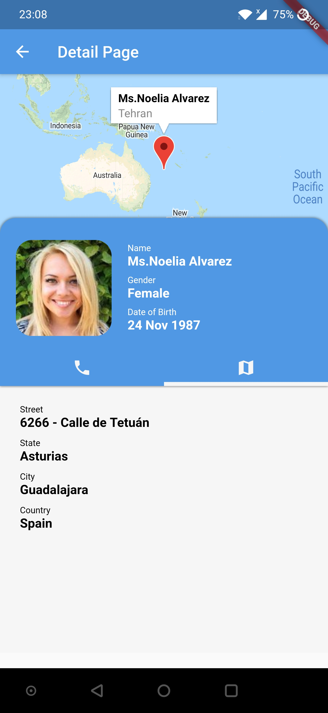

  

**Random API Users** is a school assignment project at Norton University on Year IV Semester II. The purpose to learn about Flutter Frameworks.  
 
  In this project, We have fetching data from <a href="https://randomuser.me/">randomuser.me</a> to list all the user as a card and also we created a detail screen   to see the information of each user.
  
  Duration of develop this project, We spent one week to develop.
  
# Screenshots

 

  
  
  
 

 

  
  
 

